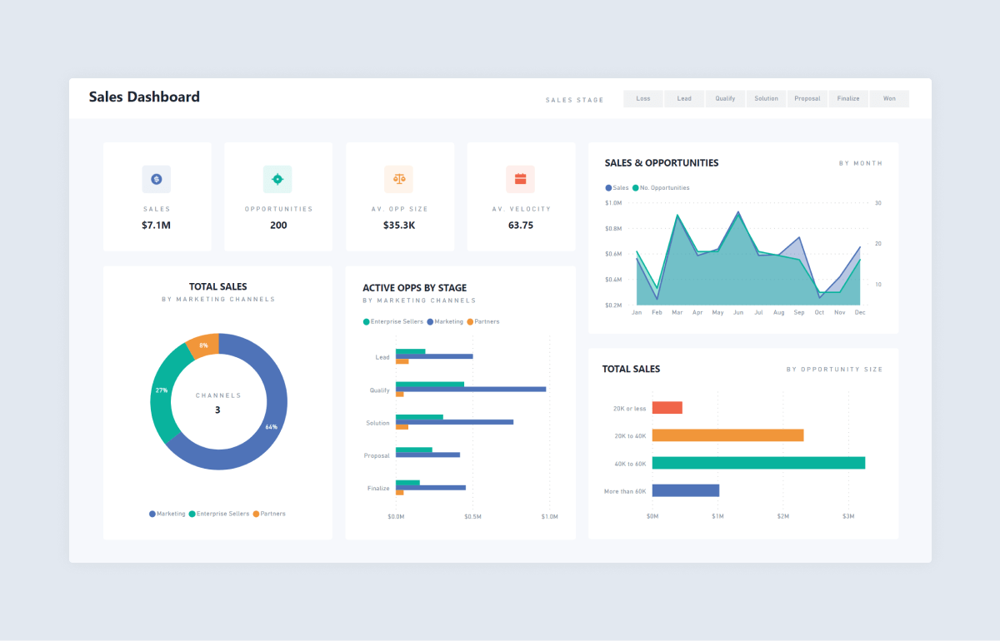

# 📊 Sales Dashboard

**Sales Dashboard – Task 3**  
Interactive dashboard built with **Power BI** using a **CSV** Sales & Financial dataset (sourced from Kaggle).

## 📌 Project Overview
This dashboard provides business stakeholders with a compact, interactive view of sales performance—highlighting KPIs, trends, channel contribution, opportunity stages, and deal-size segmentation—to support data-driven decisions.

## 🎯 Objectives
- Build an interactive and visually clear dashboard for stakeholders.  
- Surface key KPIs and monthly trends.  
- Enable drill-down with slicers/filters (date range, channel, stage).

## 📈 Key Features
- **KPI Cards:** Total Sales, Total Opportunities, Average Opportunity Size, Average Velocity.  
- **Time-Series Analysis:** Monthly sales and opportunities trends.  
- **Channel Analysis:** Sales share by Marketing, Enterprise Sellers, and Partners.  
- **Opportunity Stage Breakdown:** Pipeline distribution by stage and channel.  
- **Opportunity Size Segmentation:** Sales grouped into deal-size ranges.  
- Consistent color theme and clear labels for readability.

## 🛠 Files
- `Sales_Dashboard.pbix` — Power BI report file (open in Power BI Desktop).  
- `sales_dataset.csv` — Source CSV dataset used for the dashboard.  
- `Sales_Dashboard_Summary.pptx` — PPT summary slide deck.

## 🧭 How to Use
1. Open `Sales_Dashboard.pbix` in **Power BI Desktop**.  
2. Load `sales_dataset.csv` if required (or ensure data source paths are correct).  
3. Use slicers to filter by date range, channel, or stage.  
4. Hover over visuals for tooltips and export visuals/reports as needed.

## 🔍 Dashboard Insights (example)
- **Total Sales:** $7.1M  
- **Total Opportunities:** 200  
- **Top Channel:** Marketing (64%)  
- **Common Pipeline Stages:** Quality & Solution  
- **Peak Months:** March & July

## 📸 Preview

## ✨ Outcome
Enables stakeholders to quickly monitor KPIs, identify high-performing channels, evaluate pipeline health, and understand deal-size distribution to make informed business decisions.

---

**Author:** Upputuri Srivalli  
**Tool:** Power BI  
**Dataset:** CSV (Kaggle)
